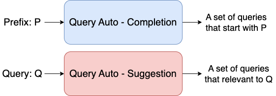

Auto complete and auto suggest are used in pretty similar ways these days but there are some key differences. In his article for UX Magazine, “Designing Search: As-You-Type-Suggestions,” Tony Russel-Rose explains exactly how the two differ.

* The purpose of auto-complete is to resolve a partial query, i.e., to search within a controlled vocabulary for items matching a given character string.

* The purpose of auto-suggest is to search a virtually unbounded list for related keywords and phrases, which may or may not match the precise query string.

  

