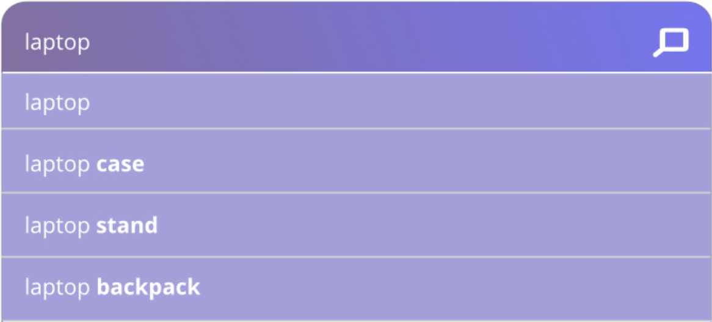

# What is Autocomplete Search?

Autocomplete is the function of search engines that displays keyword and product suggestions in real-time, based on what search query the user is typing into the search field.

The feature works in a very simple way: it detects what a customer is typing, and matches the query with data in the search index. If there are keywords or phrases stored in the index that matches what’s being typed in, it suggests those.

In reality, it’s a bit more complicated because they also take into consideration the popularity of different products and keywords when ranking suggestions.

**For example**: In an online store selling clothes, if you type in “sh”, it might suggest shoes or shirts. If the store is selling bathroom appliances, it might suggest shower curtains or shelves.

  

